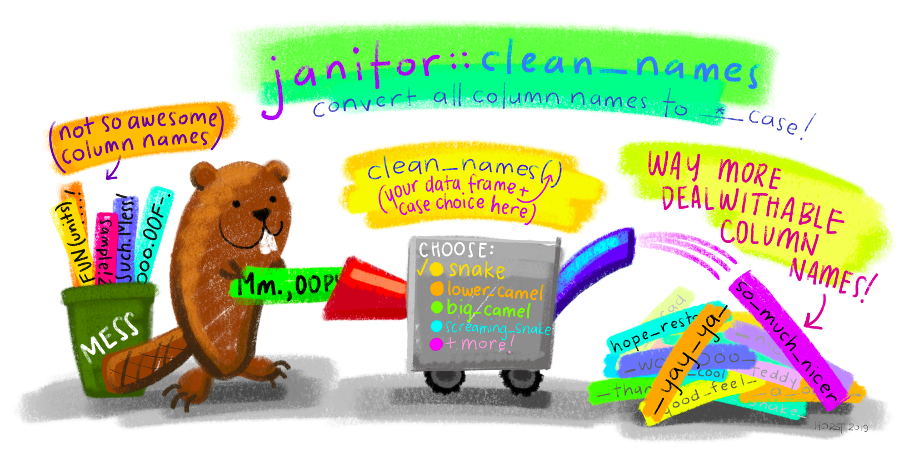
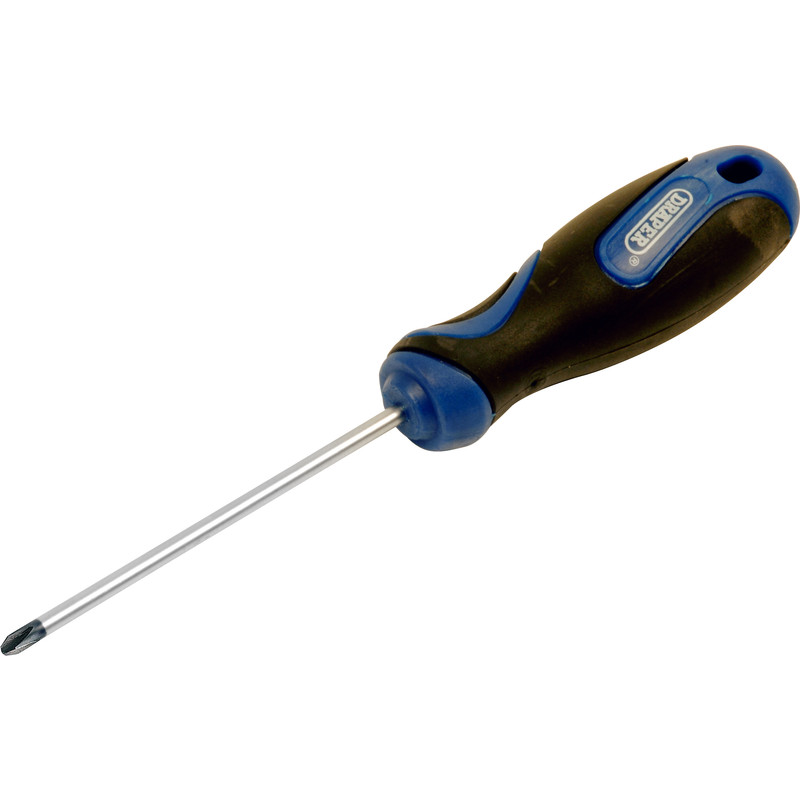

```{r setup, include=FALSE}
options(htmltools.dir.version = FALSE)
knitr::opts_chunk$set(
  fig.align = "center",
  echo = FALSE,
  eval = TRUE
)
```

class: middle, center

<!-- video 1 -->

## Para fazer ciência de dados, você precisa ser programador/a?

--

# Não

---
class: middle, center

## Para fazer ciência de dados, você precisa saber programar?

--

# Sim!

<!-- /video 1 -->


<!-- video 2 -->

---
class: middle, center, inverse


# Por que é importante saber programar?

<!-- /video 2 -->


<!-- video 3 -->

---
class: middle, center

# Linguagem é texto

---

# Linguagem é texto

```{r}
knitr::include_graphics("img/copy-paste.png")
```


<!-- /video 3 -->


<!-- video 4 -->

---
class: middle, center

# Linguagem é aberta

---

# Fóruns

```{r, out.width="430px"}
knitr::include_graphics("img/stack.png")
```


---

# Comunidades

```{r, out.width="430px"}
knitr::include_graphics("img/arte_comunidade.png")
```

<!-- /video 4 -->


<!-- video 5 -->

---
class: middle, center

# É uma linguagem

--

## Facilita compreensão

--

## Melhora a comunicação

---

# Exemplo

```{r message=FALSE, warning=FALSE, include=FALSE}
library(magrittr)
library(magick)
library(ggplot2)
library(dplyr)
library(viridis)
```

```{r frink, eval = FALSE, echo=TRUE}
image_read("https://jeroen.github.io/images/frink.png") %>%
  image_rotate(270) %>%
  image_background("blue", flatten = TRUE) %>%
  image_border("red", "10x10") %>%
  image_annotate(
    "Linguagens de programação ainda\nsão linguagens!",
    color = "white", size = 30)
```

--

.pull-left[
#### Entrada

]

--

.pull-right[
#### Saída
```{r frink-out, ref.label="frink", echo=FALSE}

```

]


<!-- /video 5 -->


<!-- video 6 -->

---
class: middle, center, inverse

# Programação e ciência de dados

---
class: center

# Definir vs Fazer

```{r}
knitr::include_graphics("img/diagrama-programacao.png")
```


<!-- /video 6 -->


<!-- video 7 -->

---
## O ciclo da ciência de dados

```{r, out.width="100%"}
knitr::include_graphics("img/ciclo-ciencia-de-dados.png")
```


<!-- /video 7 -->


<!-- video 8 -->

---
## Importação e arrumação

```{r}

```


<!-- /video 8 -->


<!-- video 9 -->

---
## Visualização e modelagem

```{r, out.width="100%"}
knitr::include_graphics("img/arte_ggplot2.png")
```


<!-- /video 9 -->

<!-- video 10 -->

---
## Comunicação de dados

```{r, out.width="100%"}
knitr::include_graphics("img/arte_rmarkdown.png")
```


<!-- /video 10 -->


<!-- video 11 -->

---
class: middle, center

# Por que o R?

---
class: center

## O R é o ciclo da ciência de dados **na prática**.

.pull-left[

#### Excel

```{r, out.width="300px"}

```


]

.pull-right[

#### R

```{r, out.width="300px"}
knitr::include_graphics("img/chave-de-fenda-r.jpg")
```

]

---

## Ciência de dados com o R

```{r, out.width="100%"}
knitr::include_graphics("img/ciclo-ciencia-de-dados-pacotes.png")
```


<!-- /video 11 -->


<!-- video 12 -->

---
class: middle, center

# Conheça nossas trilhas!

.pull-left[
<div class="container center">
  <div class="card">
    <h2>Faxina</h2>
    <hr style = "background-color: #3bb44a;"/>
  </div>
</div>

]


.pull-right[

<div class="container center">
  <div class="card">
    <h2>Visualização</h2>
    <hr style = "background-color: #ff6699;"/>
  </div>
</div>

]

<br>

<div class="container center">
  <div class="card">
    <h2>Modelagem</h2>
    <hr width='400px' style = "background-color: #996699"/>
  </div>
</div>


<!-- /video 12 -->

